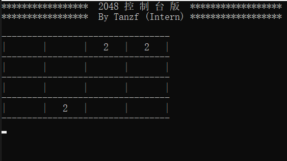
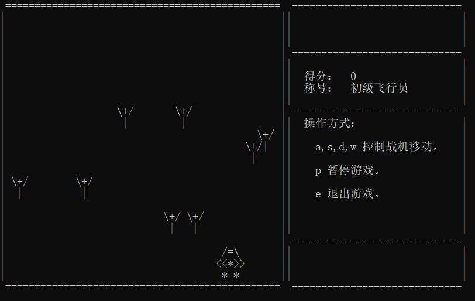
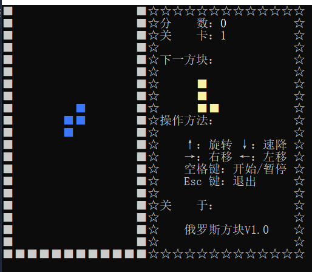
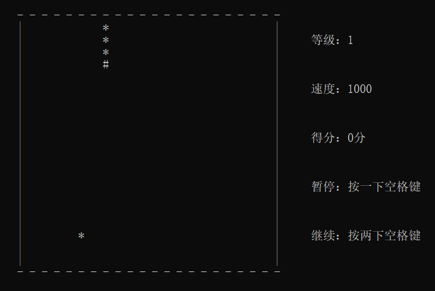

# miniGame
大学程序设计课程——C++小游戏设计（单文件可直接运行）

## 环境

- Dev-C++
- Microsoft Visual Studio 2019

## 2048——2048经典小游戏

## Plane War——飞机大战

## Tetris——俄罗斯方块

## Retro Snaker——贪吃蛇

更多内容参考:

+ [Github主页](https://github.com/JackHCC)
+ [博客主页](https://blog.creativecc.cn/)
+ [知乎](https://www.zhihu.com/people/jack-c-77)
+ [CSDN](https://blog.csdn.net/qq_43042024?spm=1010.2135.3001.5421)
+ [简书](https://www.jianshu.com/u/f4a500314f23)

© [JackHCC](https://github.com/JackHCC)
